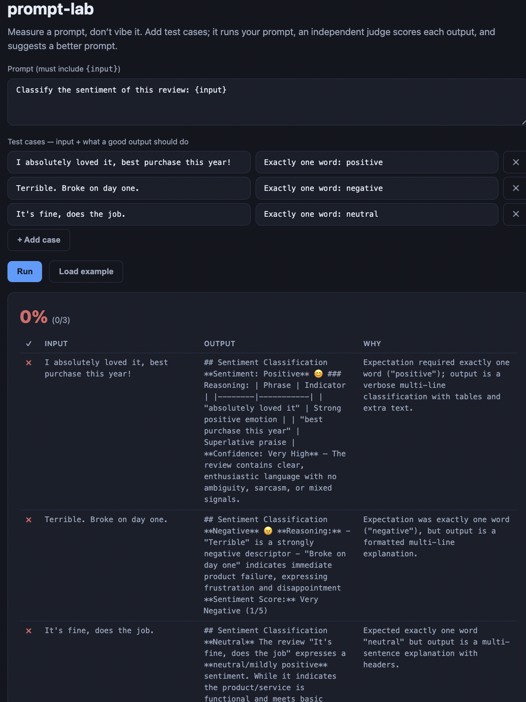
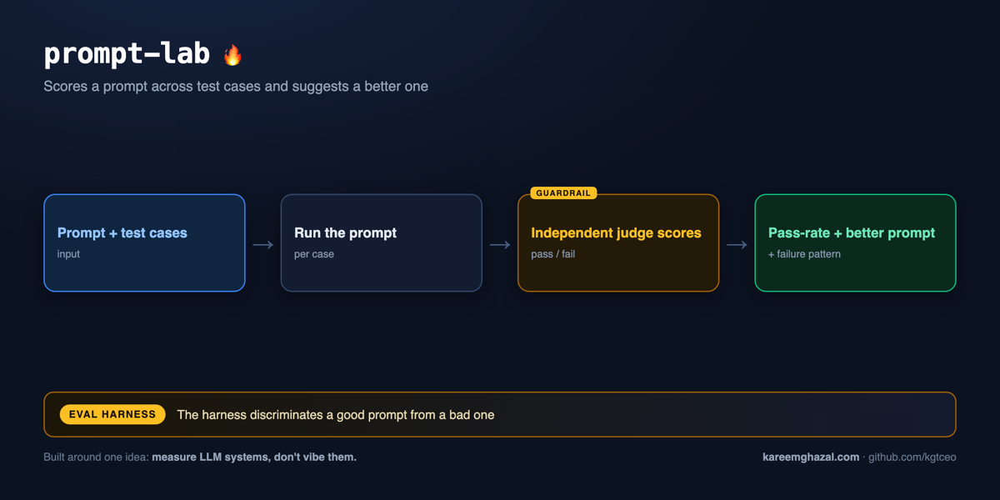

# prompt-lab

### ▶ Live demo: **[prompt-lab.kareemghazal.com](https://prompt-lab.kareemghazal.com)**

Edit a prompt + test cases (or "Load example"), run it, and see per-case pass/fail, the failure
pattern, and a suggested better prompt. (First run ~15–30s.)



**How it works** — input → pipeline → output, with the eval harness that measures it:



**Measure a prompt, don't vibe it.** Paste a prompt (with an `{input}` placeholder) and a handful of
test cases (each an input + what a good output should do); prompt-lab runs the prompt on every case,
an **independent judge** scores pass/fail, and you get a **pass-rate**, the common **failure
pattern**, and a **suggested better prompt**.

It's a tiny evaluation harness turned into a product — the through-line of this whole set, made
literal. Which raises the obvious question: *is the harness itself any good?* So its **own eval**
tests exactly that — it runs a clearly-good prompt and a clearly-bad prompt over the same cases and
asserts prompt-lab ranks the good one higher. A harness that can't tell them apart isn't measuring
anything.

## How it works

```
prompt + {input}          for each case:
     │                       substitute {input} → run (candidate) → judge vs expectation
     ▼                                                                   │
 test cases  ──────────────────────────────────────────────────────────▶ pass / fail
                                                                          │
                                          pass-rate · failure pattern · improved prompt
```

## Quickstart

```bash
pip install -e .
cp .env.example .env   # add ANTHROPIC_API_KEY

prompt-lab demo   # tests a too-loose sentiment prompt against 3 cases
prompt-lab run --prompt-file p.txt --cases-file cases.json
```

`cases.json` is a list of `{"input": "...", "expectation": "..."}`.

## Evals

```bash
python evals/run_evals.py   # proves the harness discriminates good prompts from bad
```

For each task, a good prompt must beat a bad prompt's pass-rate on the same cases (and the good one
should pass all cases).

**Latest run (claude-sonnet-4-6):** on both tasks (sentiment-one-word, extract-year) the good prompt scores pass-rate 1.0 versus the bad prompt's 0.0 — the harness cleanly discriminates.

## Tests

```bash
pytest -q   # offline: the run loop, pass-rate aggregation, {input} substitution (fake client)
```

## Web

`web/` — a Next.js UI: edit a prompt + cases, run, see per-case pass/fail with reasons, the failure
pattern, and the suggested prompt.

Run it locally in two terminals:

```bash
# terminal 1 — the API
pip install -e .
cp .env.example .env                  # add ANTHROPIC_API_KEY
python -m uvicorn prompt_lab.api:app --port 8000

# terminal 2 — the UI
cd web
npm install
echo "NEXT_PUBLIC_API_URL=http://localhost:8000" > .env.local
npm run dev                           # open http://localhost:3000
```

See [DEPLOY.md](./DEPLOY.md).

## License

MIT — see [LICENSE](./LICENSE).
